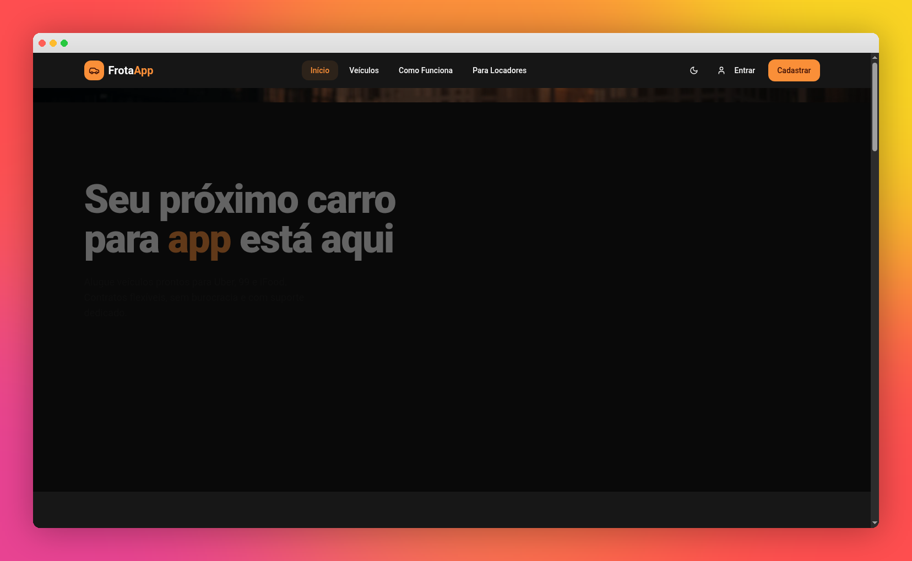
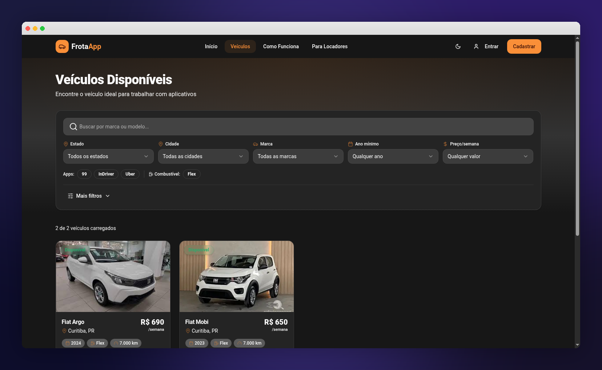

<div align="center">

# 🚗 FrotaApp Curitiba

**Plataforma inteligente de gestão de frotas e locação de veículos para aplicativos**

[](https://frotaappcuritiba.lovable.app)
[](https://react.dev)
[](https://www.typescriptlang.org)
[](https://tailwindcss.com)
[](https://vitejs.dev)

[🌐 Acessar Aplicação](https://frotaappcuritiba.lovable.app) · [📋 Funcionalidades](#-funcionalidades) · [🚀 Começar](#-como-rodar-localmente)

</div>

---

## 📸 Screenshots

<div align="center">

### Página Inicial


### Veículos Disponíveis


</div>

---

## ✨ Sobre o Projeto

O **FrotaApp Curitiba** é um SaaS completo que conecta **locadores de veículos** a **motoristas de aplicativo** na região de Curitiba. A plataforma oferece gestão operacional completa — desde o cadastro do veículo até o controle financeiro — tudo em um único lugar.

### 🎯 Para quem é?

| 👤 Perfil | 📝 Descrição | 🔑 Acesso |
|-----------|-------------|-----------|
| **Locador** | Proprietário de veículos que aluga para motoristas de app | Gestão completa da frota, contratos, pagamentos e manutenções |
| **Motorista** | Motorista de aplicativo (Uber, 99, InDriver) | Visualiza seu veículo, pagamentos, documentos e histórico |
| **Admin** | Administrador da plataforma | Gerencia usuários, métricas globais e logs de auditoria |

---

## 🛠 Funcionalidades

<table>
<tr>
<td width="50%">

### 📋 Gestão de Veículos
- Cadastro com fotos, dados e localização
- Controle de km e status em tempo real
- Filtros avançados e galeria de imagens

### 📝 Contratos
- Criação e gestão de contratos
- Vínculo veículo ↔ motorista
- Valor semanal, caução e limite de km

### 🔧 Manutenções
- Preventivas e corretivas
- Controle de custos e prestadores
- Agendamento de próximas manutenções

### 🔍 Inspeções / Vistorias
- Checklist personalizável (entrada/saída)
- Fotos e condições detalhadas
- Comparativo entre inspeções

</td>
<td width="50%">

### 👥 Motoristas
- Cadastro com CNH e contato
- Alertas de vencimento de CNH
- Vínculo com veículos e contratos

### 💰 Pagamentos
- Controle semanal por motorista
- Status, método e observações
- Exportação de relatórios

### 📄 Documentos
- Upload e gestão (CNH, CRLV, etc.)
- Solicitação de docs ao motorista
- Controle de validade

### 📊 Dashboard & Relatórios
- Indicadores de receita e ocupação
- Gráficos de evolução financeira
- Exportação de dados completa

</td>
</tr>
</table>

### 🔔 Extras
- **Notificações em tempo real** via WebSocket
- **Alertas automáticos** de CNH e manutenções
- **Tema escuro/claro** com alternância
- **Layout responsivo** para mobile e desktop
- **Segurança** com RLS (Row Level Security) e auditoria completa

---

## 🏗 Arquitetura & Tecnologias

```
┌─────────────────────────────────────────────────┐
│                   Frontend                       │
│  React 18 · TypeScript 5 · Vite 5 · Tailwind v3 │
│  shadcn/ui · Framer Motion · Recharts            │
├─────────────────────────────────────────────────┤
│                Lovable Cloud                     │
│  Auth · Database (PostgreSQL) · Storage · Edge   │
│  Functions · Realtime · Row Level Security       │
└─────────────────────────────────────────────────┘
```

| Camada | Tecnologia |
|--------|-----------|
| **UI Framework** | React 18 + TypeScript 5 |
| **Build** | Vite 5 |
| **Estilização** | Tailwind CSS v3 + shadcn/ui |
| **Backend** | Lovable Cloud (PostgreSQL, Auth, Storage, Edge Functions) |
| **Testes** | Vitest (unitários) + Playwright (E2E) |
| **Realtime** | WebSocket via Lovable Cloud |

---

## 🚀 Como rodar localmente

```bash
# Clone o repositório
git clone <URL_DO_REPOSITORIO>

# Acesse o projeto
cd frotaapp-curitiba

# Instale as dependências
npm install

# Inicie o servidor de desenvolvimento
npm run dev
```

Acesse **http://localhost:5173** no navegador.

---

## 🧪 Testes

```bash
# Testes unitários
npm run test

# Testes E2E (requer Playwright)
npx playwright install chromium
npm run test:e2e

# Testes E2E com interface visual
npm run test:e2e:ui
```

---

## 📂 Estrutura do Projeto

```
src/
├── components/        # Componentes reutilizáveis
│   ├── auth/          # Autenticação (login, cadastro)
│   ├── dashboard/     # Dashboard e gráficos
│   ├── vehicles/      # Gestão de veículos
│   ├── contracts/     # Contratos
│   ├── maintenance/   # Manutenções
│   ├── inspections/   # Inspeções / vistorias
│   └── ui/            # Componentes base (shadcn)
├── hooks/             # Custom hooks
├── pages/             # Páginas por perfil
│   ├── locador/       # Painel do locador
│   ├── motorista/     # Painel do motorista
│   └── admin/         # Painel administrativo
├── routes/            # Configuração de rotas
└── types/             # Tipos TypeScript
```

---

<div align="center">

### Feito com ❤️ em Curitiba, PR

[](https://lovable.dev)

</div>
